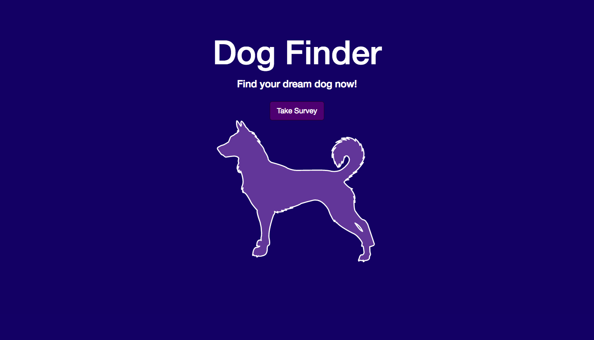
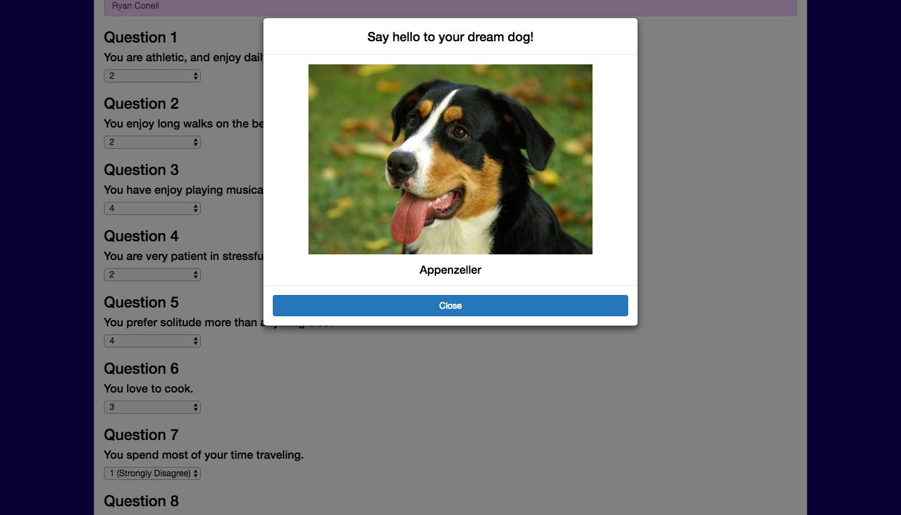

# Dog Finder

<https://efosa-dog-finder.herokuapp.com/> \
Version 1.0 \
Deployment Date: February 19, 2018  \
Contributors: Efosa Ogiesoba

# Purpose

This is a simple app that will help users find their dream dog. It was built as a homework project to help increase proficiency in Express.js and Anime.js. Users will take a short survey and app will display their dog.

# Screenshot - 1 - Dog Finder Home Page

# Screenshot - 2 - Dog Finder Survey Page

# IceBox

Ideas for future development.

1) Add link to nearby animal shelters where you can find your dream dog.
